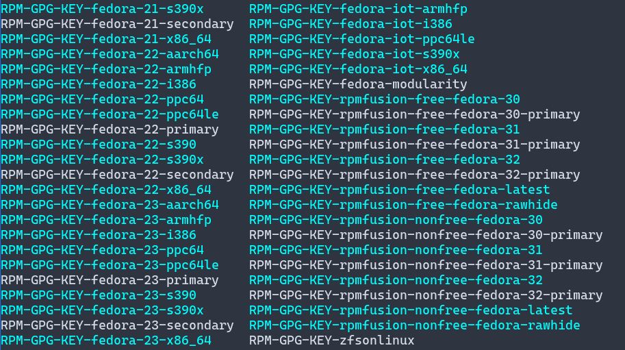
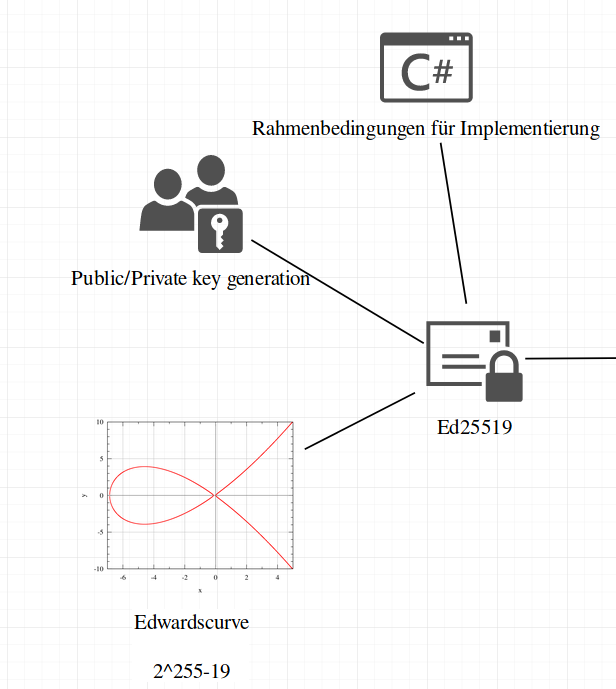
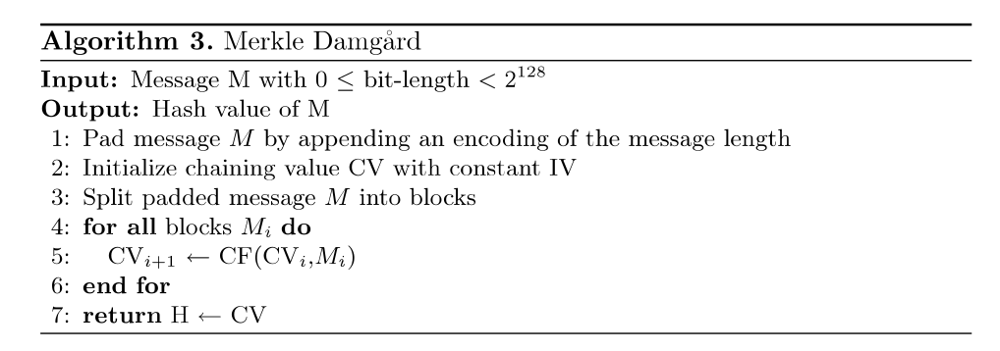
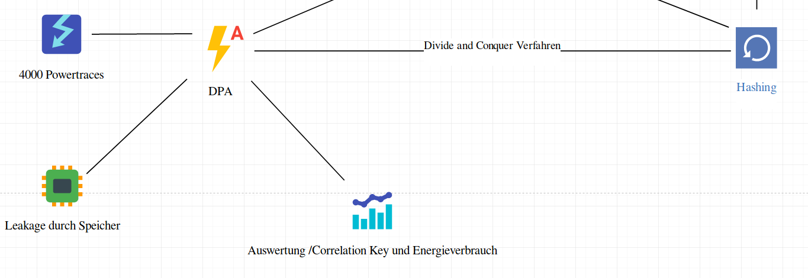
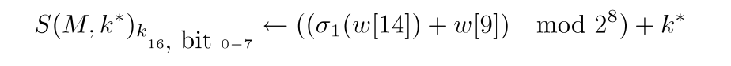
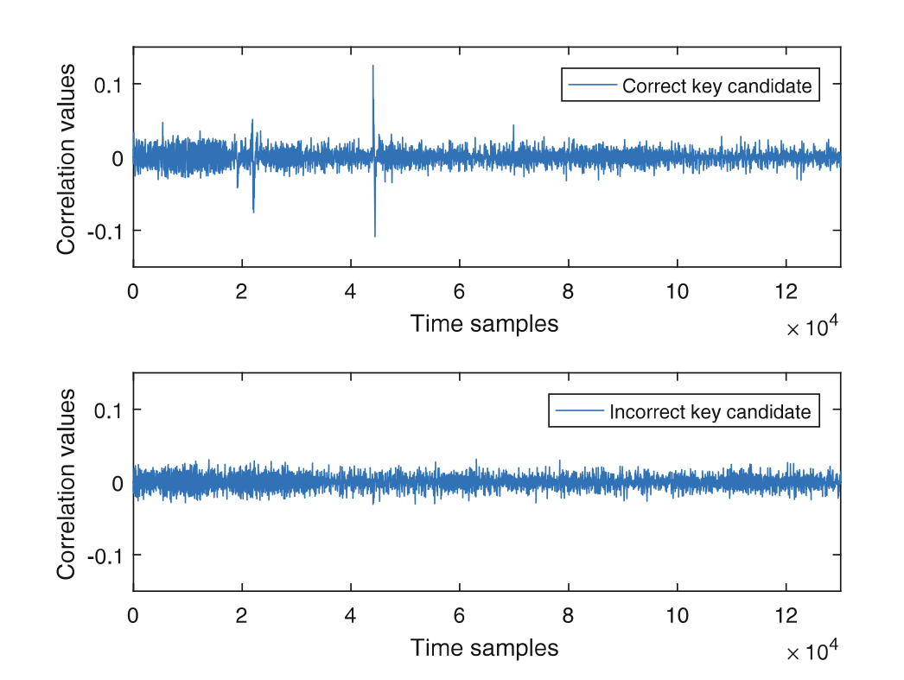
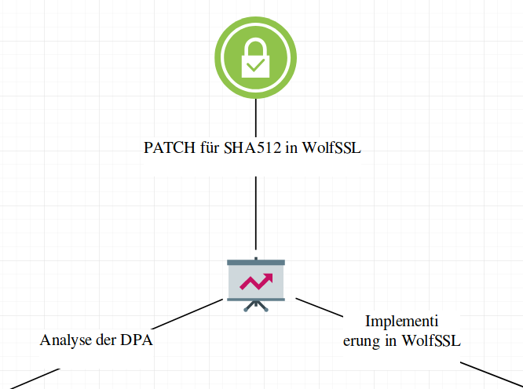

---
title:
- Breaking Ed25519 in WolfSSL
author:
- Luis Kress, Johannes Hausmann
date:
- 23-10-2019
fontfamily: 
- roboto
titlegraphic:
- /home/dracula/Bilder/TH-Bingen-Logo-schwarz-50.png
---

# Beispiel

# Digitale Signatur und Verschlüsselung I

* Pendant der schriftlichen Signatur
	+ Unterschrift auf Brief, Urkunde
* Dokument → Erklärung, Vereinbarung
* Nachweis
	+ Inhalt des Dokument (Unterzeichner)
	+ Verifikation (Empfänger)
* Signatur ausschließlich durch Unterzeichner
* Verifikation soll jedem möglich sein

# Digitale Signatur und Verschlüsselung II

1.  Eine digitale Signatur ist ein String, welcher eine Nachricht mit einer Entität verbindet
2.  Algorithmus zur Signaturerzeugung  
3.  Algorithmus zur Signaturverifikation 
4.  Signatur Schema (signature scheme) → Erzeugung & Verifikation
5.  Signaturprozess → Formatierung der Daten in signierbare Nachrichten
6.  Verfikationsprozess 

# Digitale Signatur und Verschlüsselung III

* Realisierung durch assymetrische Kryptoalgorithmen

* Message
* K~Priv~
* K~Pub~
* Einwegfunktion $$f(K~Priv~) = K~Pub~$$
* inverse Funktionen
	+ Signatur (Message, K~Priv~)
	+ Verifikation (Message, Signatur, K~Pub~)

* K~Pub~ in öffentlichem Verzeichnis

# Beispiel für Verwendung von Digitale Signaturen

* SSL Zertifikat (CA)
* Software Installation auf Linux / BSD Systemen

* Elektronische Steuerklärung

#
.png)

# 



# EDCSA & Ed25519

* Signaturverfahren basierend auf Eliptic Curve Cryptography (EEC)
	+ Basis ist eine Punktruppe einer Elliptischen Kurve 
* RSA → Faktosisierungsproblem (Primzahlen)
* ECDSA ist verbereitet
	+ EdDSA (Edwardscurve)
	+ Ed25519 (Edwardscurve 25519)
* 160bit EEC Schlüssel = 1200bit RSA Schlüssel
	+ Speicherverbrauch, Energieverbrauch (IoT)

# EDCSA & Ed25519

* Verwendung
	+ OpenSSH 
	+ WolfSSL / OpenSSL / LibreSSL / GnuTLS 
	+ Tor Protokoll
	+ DNS Protokolle
	+ Signal Messenger Protokoll


# Ed25519 Funktionsweise

__Tafelbild__

#
.png)

#


# Secure Hash "SHA512"

* Ed25519 nutzt SHA512
	+ Merkle–Damgård Konstruktion
		+ Erweiterung um Davies-Meyer 
	+ SHA-2 Familie (SHA256,SHA512) → Bitlänge des Hash

* Auxiliary Schlüssel b 

```shell
Message M (v. Länge) → SHA512 Funktion → 512 Bit Ausgabe
```

# Secure Hash "SHA512" II



# Secure Hash "SHA512" III

* Ausgabe 512 Bit
* Größe des internen Status 512 Bit
* Blockgröße 1024 Bit
	+ 16 Wörter
	+ Wortgröße von 64 Bit
* 80 Runden 
* Operationen auf Status
	+ AND / XOR 
	+ Addition (mod 2^64^)

#
.png)

#


# Angriff auf Ed25519

* __Key Recovery__ Attacke 
	+ Energieverbrauch eines SOCs
* Angriff bei Berechnung der  "flüchtigen" Schlüssel
	+ von Interesse ist Schlüssel b
* Hilfsschlüssel r bekannt
	+ Scalar a, Hilfsschlüssel b → manipulierte Signaturen

# Angriff auf Ed25519 II

* Differential Power Analysis (DPA)
	+ SDA → Abhängigkeit Daten und Energieverbrauch
	+ Energieverbrauch an einem Punkt der Encryption

* Zwischenwert (Interdemediate Value)
	+ Value mit bekanntem Teil/Message
	+ Wert als Funktion darstellbar

$$ f(d,k) = Value $$


# Angriff auf Ed25519 III

* 64 bit unbekannte Bits
	+ 2^64^ mögliche Schlüssel
* Divide-and-Conquer Strategie
	+ 8 Bit → 256 mögliche Schlüssel



* Hamming Weight wird berechnet (Anzahl Traces X Key Kandidaten)
* Pearson Korrelation der Zeit (Time Samples, Hamming Weight )

```shell 
Zu jedem Schlüssel Kandidaten muss jedes    
Time sample eines Traces zugeordnet werden    
→ korrekte Ausrichtung für jeden Schlüssel  
→ Vergleichbarkeit
```

# Angriff auf Ed25519 IIII



#

.png)

#




# Verbesserung & Gegenmaßnahmen

* Schlüssel & Nachricht nicht gemeinsam in Kompressionsfunktion

* Padding bereits bei Schlüssel durchführen
	+ Random Werte 

* Vorteil
	+ Verifikation Sigantur bleibt gleich
	+ Implemetierung des SHA wird geändert

* Nachteil für IoT 
	+ Verlust der deterministischen Berechnung 
	+ Berechnungszeit steigt 

#

.png)
