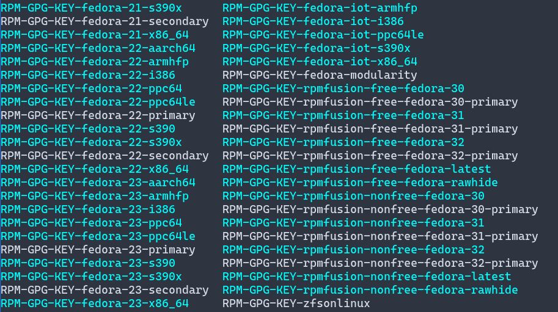
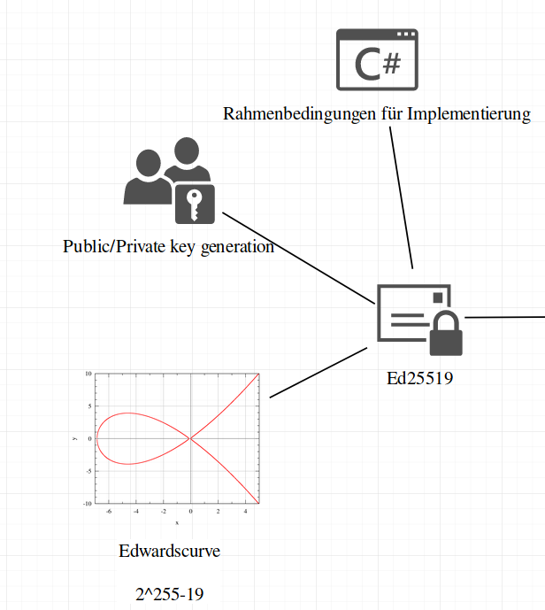
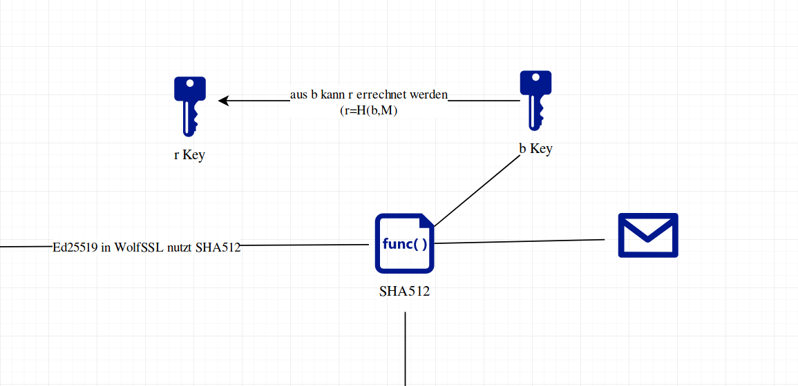
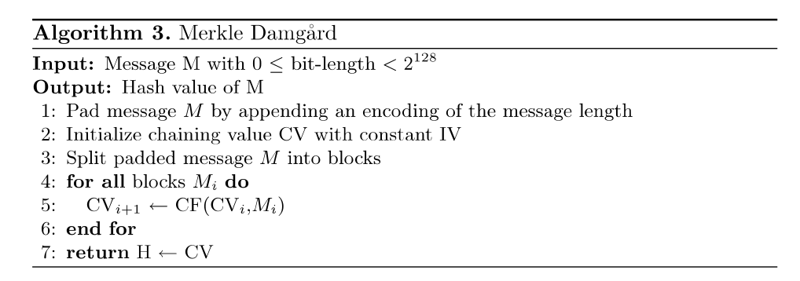
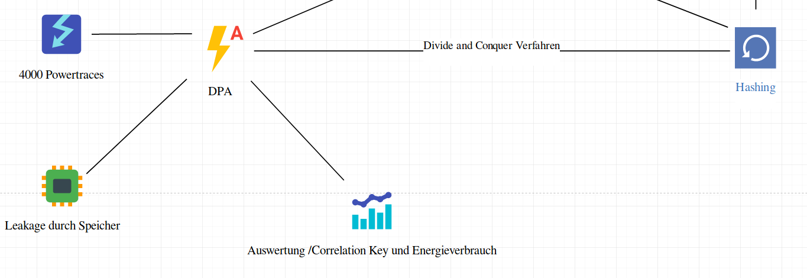
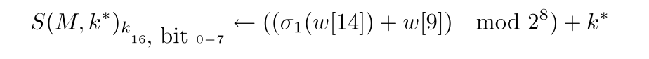
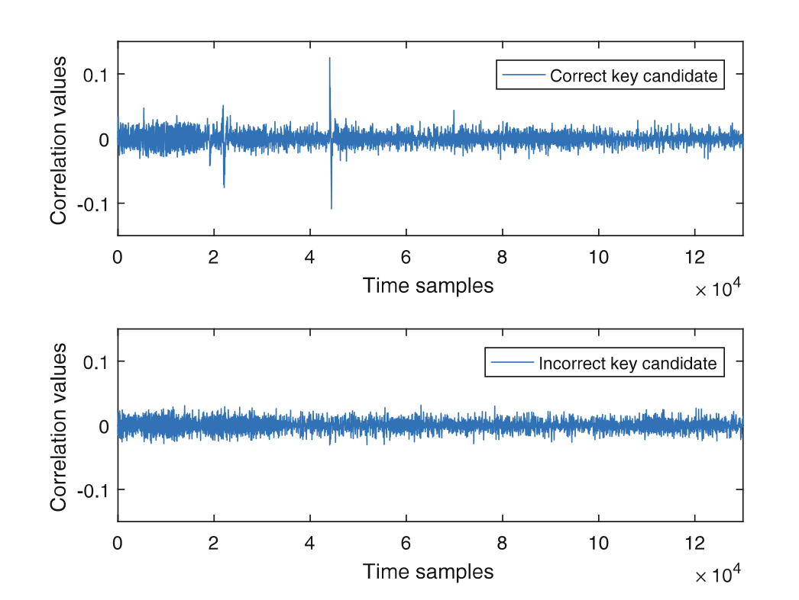
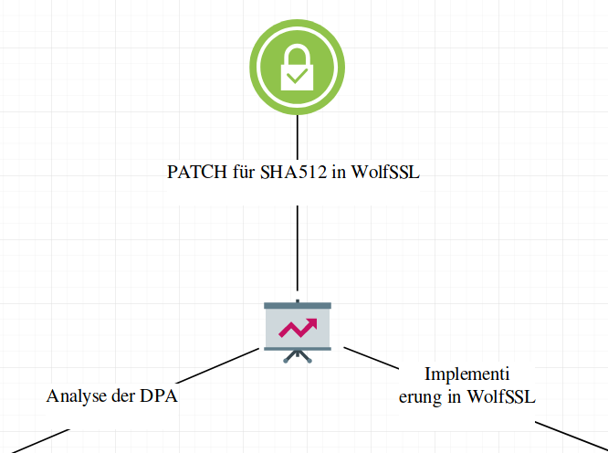

---
title:
- Breaking Ed25519 in WolfSSL
author:
- Luis Kress, Johannes Hausmann
date:
- 30-01-2020
theme:
- Dresden
colortheme:
- seahorse
titlegraphic:
- Abbildungen/TH-Bingen-Logo-schwarz-50.png
institute:
- Technische Hochschule Bingen
aspectratio:
- 43
fontsize:
- 10pt
#pagestyle:
#- plain
#navigation:
#- frame
bibliography:
- Literatur/bib.bibtex
reference-section-title:
- Literatur
---

# Digitale Signatur und Verschlüsselung I

* Pendant der schriftlichen Signatur

. . . 

* Dokument →  Erklärung, Vereinbarung

. . . 

* Nachweis
	+ Inhalt des Dokument (Unterzeichner)
	+ Verifikation (Empfänger)

. . . 
  
* Signatur ausschließlich durch Unterzeichner

. . . 

* Verifikation soll jedem möglich sein   
   
siehe [@huhnlein2006grundlagen]

# Digitale Signatur und Verschlüsselung II

1.  Eine digitale Signatur ist ein String, welcher eine Nachricht mit einer Entität verbindet
2.  Algorithmus zur Signaturerzeugung  
3.  Algorithmus zur Signaturverifikation 
4.  Signatur Schema (signature scheme) →  Erzeugung & Verifikation
5.  Signaturprozess →  Formatierung der Daten in signierbare Nachrichten
6.  Verfikationsprozess  
siehe @katz1996handbook

# Digitale Signatur und Verschlüsselung III

* Realisierung durch asymetrische Kryptoalgorithmen

* Message
* K~Priv~ , K~Pub~
* Einwegfunktion $$f(K~Priv~) = K~Pub~$$
* inverse Funktionen
	+ Signatur (Message, K~Priv~)
	+ Verifikation (Message, Signatur, K~Pub~)

* K~Pub~ in öffentlichem Verzeichnis   
siehe [@huhnlein2006grundlagen]

# Beispiel für Verwendung von Digitale Signaturen

* SSL Zertifikat (CA)
* Software Installation auf Linux / BSD Systemen
* Elektronische Steuerklärung

{width=60%, height=60%}

#

_res.png)

# 



# ECDSA & Ed25519

* Signaturverfahren basierend auf Eliptic Curve Cryptography (ECC)
	+ Basis ist eine Punktruppe einer Elliptischen Kurve 

. . .


* ECDSA ist verbereitet

	. . .

	+ EdDSA (Edwardscurve)

	. . . 	
	
	+ Ed25519 (Edwardscurve 25519)

	. . . 

* 160bit ECC Schlüssel = 1200bit RSA Schlüssel
	+ Speicherverbrauch, Energieverbrauch (IoT)  
  
siehe [@huhnlein2006grundlagen; @susella2018breaking]

# ECDSA & Ed25519

* Verwendung [@susella2018breaking]
	+ OpenSSH 
	+ WolfSSL / OpenSSL / LibreSSL / GnuTLS 
	+ Tor Protokoll
	+ DNS Protokolle
	+ Signal Messenger Protokoll

{height=50%} 

# Ed25519 Funktionsweise

__Tafelbild__

#

.png)

#



# Secure Hash "SHA512"

* Ed25519 nutzt SHA512
	  
	+ Merkle–Damgård Konstruktion
		+ Erweiterung um Davies-Meyer 
	  
	+ SHA-2 Familie (SHA256,SHA512) → Bitlänge des Hash

* Auxiliary Schlüssel b 

```shell
Message M (Länge n) → SHA512 Funktion → 512 Bit Ausgabe
```
  
[@susella2018breaking]

# Secure Hash "SHA512" II



# Secure Hash "SHA512" III

* Ausgabe 512 Bit

. . . 

* Größe des internen Status 512 Bit

. . . 

* Message expansion auf 80 schedulde words
	
	. . . 

	* Messageblock 1024 Bit
	
		. . . 

		+ 16 Wörter
	
		. . . 

		+ Wortgröße von 64 Bit

* 80 mal Rundenfunktion auf schedule words 

. . . 

* Operationen auf Status
	+ AND / XOR 
	+ Addition (mod 2^64^)
  
[@susella2018breaking]

# Übergabewerte für SHA512

* Wörter 0-3 = Private Key (256 Bit)
  
  

* Wörter 4-15 = Message


#

\includegraphics[page=1,width=\paperwidth]{SHAFunkt.pdf}

#

\includegraphics[page=2,width=\paperwidth]{SHAFunkt.pdf}

#

\includegraphics[page=3,width=\paperwidth]{SHAFunkt.pdf}

#

\includegraphics[page=4,width=\paperwidth]{SHAFunkt.pdf}

#

\includegraphics[page=5,width=\paperwidth]{SHAFunkt.pdf}

#

\includegraphics[page=6,width=\paperwidth]{SHAFunkt.pdf}

#

\includegraphics[page=7,width=\paperwidth]{SHAFunkt.pdf}

#

\includegraphics[page=8,width=\paperwidth]{SHAFunkt.pdf}

#

\includegraphics[page=9,width=\paperwidth]{SHAFunkt.pdf}

#

\includegraphics[page=10,width=\paperwidth]{SHAFunkt.pdf}

#

\includegraphics[page=11,width=\paperwidth]{SHAFunkt.pdf}

#

\includegraphics[page=12,width=\paperwidth]{SHAFunkt.pdf}

#

\includegraphics[page=13,width=\paperwidth]{SHAFunkt.pdf}

#

\includegraphics[page=14,width=\paperwidth]{SHAFunkt.pdf}

#

\includegraphics[page=15,width=\paperwidth]{SHAFunkt.pdf}

#

\includegraphics[page=16,width=\paperwidth]{SHAFunkt.pdf}

#

\includegraphics[page=17,width=\paperwidth]{SHAFunkt.pdf}

#
.png)

#


# Angriff auf Ed25519

* __Key Recovery__ Attacke 
	+ Energieverbrauch eines SOCs

. . . 

* Angriff bei Berechnung des "flüchtigen" privaten Schlüssels
	+ von Interesse ist Hilfschlüssel b

. . . 

* Flüchtiger Schlüssel r bekannt
	+ Scalar a, Hilfsschlüssel b → manipulierte Signaturen

# Angriff auf Ed25519 II

* Differential Power Analysis (DPA)
	+ SDA → Abhängigkeit Daten und Energieverbrauch
	+ Energieverbrauch an einem Punkt der Encryption

. . . 

* Zwischenwert (Intermediate Value)
	+ Value mit bekanntem Teil/Message
	+ Wert als Funktion darstellbar

. . . 


$$ S(M,k) = Value $$


# Angriff auf Ed25519 III

* 64 bit unbekannte Bits
	+ 2^64^ mögliche Schlüssel

. . . 

* Divide-and-Conquer Strategie
	+ 8 Bit → 256 mögliche Schlüssel

. . .

{width=60%, height=60%}

. . . 

* Hamming Weight wird berechnet (Anzahl Traces X Key Kandidaten)

. . . 

* Pearson Korrelation der Zeit (Time Samples, Hamming Weight )

```shell 
Zu jedem Schlüssel Kandidaten muss jedes    
Time sample eines Traces zugeordnet werden    
→ korrekte Ausrichtung für jeden Schlüssel  
→ Vergleichbarkeit
```

# Angriff auf Ed25519 IIII

{height=95%}

#

.png)

#




# Verbesserung & Gegenmaßnahmen

* Schlüssel & Nachricht nicht gemeinsam in Kompressionsfunktion

. . . 

* Padding bereits bei Schlüssel durchführen
	+ Random Werte 

. . . 

* Vorteil
	+ Verifikation Sigantur bleibt gleich
	+ Implemetierung des SHA wird geändert

. . . 

* Nachteil für IoT 
	+ Verlust der deterministischen Berechnung 
	+ Berechnungszeit steigt 

# IN A NUTSHELL

* Signaturerzeugung

. . . 

* geheime Schlüssel errechnen

. . .

* Schwachstelle = "fahrlässige" __Nutzung__ des SHA512 

. . . 

* Fehlerhafte Implementierung → leichte Gegenmaßnahme

# Literatur
